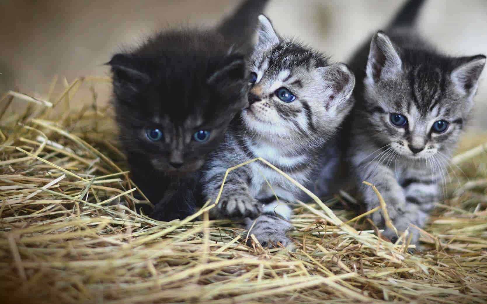

# ***La web de los gatitos***

Está página web ha sido construída con javascript vanilla y css.

Si quieres probarla ~~no entres~~ entra en la siguiente URL
https://jgl1201.github.io/Entornos_Gatitos/

Esta página fue creada con la ayuda de Ángel.
Visítalo en GitHub @kant003 , síguelo y dale 🌟.

[Mucha información sobre los gatitos](https://es.wikipedia.org/wiki/Felis_silvestris_catus)

![foto de seis gatos][foto_gatos]

## Lista de características de los gatos

- Tamaño
  - Unos 46 cm de longitud
  - Entre 23 y 25 cm de alto
- Peso
  - Entre 2,5 y 7 kg
  - Algunas razas sobrepasan los 11 kg
- Longevidad
  - Entre 12 y 14 años los domésticos
  - Entre 14 y 16 los salvajes
  > El gato más longevo vivió 38 años

## Cosas que deberías y no hacer con tu gato

- [x] Alimentarlo
- [x] Ponerle agua
- [x] Vacunarlo
- [x] Desparasitarlo
- [ ] Bañarlo
- [x] Quererlo
- [x] Cuidarlo
- [x] Mimarlo
- [ ] Tirarle de las orejas
- [ ] Tirarle del rabo

## Comparativa de características según la raza

| Raza | Tamaño | Peso | Duración |
| :---- | :----: | :--: | -------: | 
| Azul Hermoso | 30 cm | 2-5 kg | 12-16 años|
| Birmano | 25-35 cm | 3-6 kg | 10-14 años |
| Naranja | 25-40 cm | 3-7 kg | 12-15 años |

## Código fuente de la página

```html
<!DOCTYPE html>
<html lang="en">
<head>
    <meta charset="UTF-8">
    <meta http-equiv="X-UA-Compatible" content="IE=edge">
    <meta name="viewport" content="width=device-width, initial-scale=1.0">
    <title>Document</title>
    <style>
        .container {
            display: flex;
            flex-direction: row;
            gap: 10px;
        }
        .container img {
            width: 100px;
            border-radius: 10px;
            box-shadow: rgba(0, 0, 0, 0.35) 0px 5px 15px;
        }
        h2 {
            background: #1B21CF;
            background: linear-gradient(to right, #1B21CF 0%, #58CF4B 100%);
            -webkit-background-clip: text;
            -webkit-text-fill-color: transparent;
        }
    </style>
</head>

<body>
    <h2>La mejor web de gatitosssss</h2>   
    <div class="container">
        
        
        
        
    </div> 
</body>

</html>
```

[foto_gatos]:
https://upload.wikimedia.org/wikipedia/commons/thumb/6/64/Collage_of_Six_Cats-02.jpg/1024px-Collage_of_Six_Cats-02.jpg